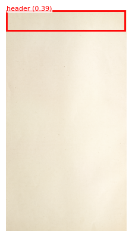

# TexBig: Object Detection and Robust Learning

 

## Introduction

 

This project revolves around developing an efficient object detection model under resource constraints commonly faced in real-world scenarios. The objective is to construct a comprehensive solution for a complex task using the TexBig dataset. The project entails selecting and adapting a suitable model from the PyTorch model zoo, conducting an ablation study to evaluate the impact of modifications on model performance, and iteratively improving the model based on learnings from each iteration. Techniques such as data augmentation, regularization, and hyperparameter tuning will be utilized to enhance the model's robustness and overall performance.

 

## Table Of Contents

 

- [TexBig: Object Detection and Robust Learning](#texbig-object-detection-and-robust-learning)
    - [Introduction](#introduction)
    - [Table Of Contents](#table-of-contents)
    - [Problem Statement](#problem-statement)
    - [Proposed Solutions](#proposed-solutions)
        - [Faster RCNN](#faster-rcnn)
            - [Objection Localization](#objection-localization)
            - [Robust Handling of Regions \& Feature Extraction](#robust-handling-of-regions--feature-extraction)
            - [Transfer Learning](#transfer-learning)
                - [FASTERRCNN\_RESNET50\_FPN](#fasterrcnn_resnet50_fpn)
                - [FASTERRCNN\_RESNET50\_FPN\_V2](#fasterrcnn_resnet50_fpn_v2)
        - [Hyperparameters](#hyperparameters)
            - [Optimiser](#optimiser)
                - [Learning Rate](#learning-rate)
                    - [Learning Rate Selection](#learning-rate-selection)
                    - [Learning Rate Scheduler](#learning-rate-scheduler)
                    - [Weight Decay \& Momentum](#weight-decay--momentum)
            - [Image Augmentation](#image-augmentation)
    - [Dataset Description](#dataset-description)
    - [Installation](#installation)
    - [Usage](#usage)
        - [Folder Structure](#folder-structure)
        - [Training \& Validation](#training--validation)
        - [Inferences](#inferences)
    - [Experimental Results](#experimental-results)
    - [Discussion / Analysis](#discussion--analysis)
    - [Outlook / Future Work](#outlook--future-work)
    - [References](#references)

 

## Problem Statement

 

For this project we’re developing deep learning models that are specifically designed for a dataset called TexBig. TexBig is an instance segmentation dataset proposed by this paper [1]. There are over 52,000 instances, each belonging to one of the 19 distinct classes. Expert annotators manually annotated these instances, employing instance segmentation through bounding boxes and polygons/masks.

The task is to develop a deep learning model for object detection using the TexBiG dataset, with a specific focus on historical document layout analysis. My goal is to create a model that can accurately predict instance segmentation annotations, such as bounding boxes and polygons/masks, for the different classes within the dataset.

The challenges in this project arise from the complexity and diversity of the historical documents in the TexBiG dataset. These documents may exhibit variations in font styles, sizes, layouts, and formats, making the detection and classification of instances more challenging. Additionally, the presence of noise, occlusions, and variations in document quality further complicates the task.

Overall, this project aims to leverage machine learning techniques to address the object detection problem within historical documents using the TexBiG dataset. By achieving high accuracy and robustness in detecting and classifying instances, the developed models will provide valuable tools for document analysis and historical research.

 

## Proposed Solutions

 

### Faster RCNN

 

There are a couple of points that Faster RCNN [2] might be promising for the task at hand such as:

Figure 1. Architecture of an R-CNN model, visualizing the pipeline [2]

 

#### Objection Localization

 

- Faster R-CNN excels in accurate object localization, which is essential for document layout analysis. The TexBiG dataset requires precise identification and segmentation of document elements. Faster R-CNN's region proposal network (RPN) generates potential object regions, and subsequent stages refine and classify these regions with high localization accuracy. By leveraging Faster R-CNN's object localization capabilities, we can accurately identify and delineate text, images, headings, tables, and other document components, contributing to effective document layout analysis.

 

#### Robust Handling of Regions & Feature Extraction

 

- Faster R-CNN utilizes a powerful feature extractor, such as ResNet 50, as its backbone network. This allows it to capture rich visual features that are crucial for accurately detecting and analyzing document components. The robust handling of regions and feature extraction capabilities of Faster R-CNN ensure the model's effectiveness in handling the diverse layouts and complex structures within the TexBiG dataset.

 

#### Transfer Learning

 

- Transfer learning is another advantage of Faster R-CNN, as it allows the model to leverage pre-trained models on large-scale datasets such as COCO. By fine-tuning a pre-trained Faster R-CNN model on the TexBiG dataset, we can benefit from the learned visual representations, enabling faster convergence and potentially enhancing the model's ability to detect and analyze document elements accurately, even with limited labeled data.
 
  

##### FASTERRCNN_RESNET50_FPN
 
  

- This [pretrained model](https://pytorch.org/vision/main/models/generated/torchvision.models.detection.fasterrcnn_resnet50_fpn.html) is available in the pytorch zoo and was based off this paper [2]. 

- The weights that will be used is going to be the ones trained on the COCO dataset.

- This PyTorch model that combines Faster R-CNN, ResNet-50, and Feature Pyramid Network (FPN) for object detection tasks. It utilizes the powerful ResNet-50 architecture for feature extraction and incorporates FPN to handle objects of different scales effectively. The model generates region proposals using a region proposal network (RPN) and classifies and refines the proposed regions with a detection network as mentioned previously. This model has achieved impressive results in accurately detecting and classifying objects in images, making it a popular choice for object detection tasks.
 
  

##### FASTERRCNN_RESNET50_FPN_V2

 

- This [pretrained model](https://pytorch.org/vision/main/models/generated/torchvision.models.detection.fasterrcnn_resnet50_fpn_v2.html#torchvision.models.detection.fasterrcnn_resnet50_fpn_v2) is available in the pytorch zoo and was based off a paper proposed by Facebook AI Research [3].

- The architecture is nearly identical to the first version; however, the training techniques were different. 

- In the second version the main difference is the inclusion of a Vision Transformer (ViT). This vision transformer was used as the backbone only during training. 
  
- The second version of the Faster RCNN model was trained using ViT as the backbone. However, the usage of the model does not include ViT and rather only uses it for the RPN.

- The following code from Pytorch's backend better represents this FPN: 

`weights = FasterRCNN_ResNet50_FPN_V2_Weights.verify(weights)`

`weights_backbone = ResNet50_Weights.verify(weights_backbone)`

  

### Hyperparameters

 

For all the iterations and different trials the hyper parameters were fixed. For the optimiser Stochastic Gradient Descent (SGD) was selected. A linear learning rate scheduler was also included for all trials. Image augmentation was only considered for the last iteration since it almost trippled the training duration for a single epoch. 

 

#### Optimiser

 

SGD is well-suited for Faster R-CNN due to its simplicity and effectiveness in optimizing deep learning models. It offers fast convergence and the ability to handle large-scale datasets efficiently. Additionally, SGD provides a stochastic nature that enables exploration of diverse training samples, facilitating better generalization and robustness in object detection tasks. Its widespread adoption and successful application in previous works further validate its suitability for Faster R-CNN. [4][5]

 

##### Learning Rate

 

###### Learning Rate Selection

 

The selection of learning rates in Faster R-CNN is crucial for achieving optimal training performance and convergence. In practice, a range of learning rates is typically explored to find the most suitable value for a specific dataset and model architecture. Previous works [6][7] have shown that learning rates in the order of 0.001 to 0.1 yield favorable results in Faster R-CNN. By trying multiple learning rates, researchers can identify the optimal balance between fast convergence and stable training dynamics, ensuring effective object detection performance.

 

###### Learning Rate Scheduler

 

Linear learning rate scheduling has been shown to be effective in improving training dynamics and convergence in various deep learning applications. In the context of object detection, the adoption of linear learning rate schedules has demonstrated promising results. For instance, the paper by Chen et al. [8] highlights the benefits of a linear warm-up strategy, where the learning rate is gradually increased from a small initial value. This approach helps stabilize training and allows the model to learn more efficiently. Similarly, the study by He et al. [9] discusses the use of a linear learning rate schedule in their experiments with object detection networks, emphasizing its contribution to faster convergence and improved performance. These findings reinforce the utility of linear learning rate schedules as a valuable technique for optimizing the training of object detection models.

This learning rate scheduler is builtin within the engine file and is already run without explicity mentioning it.

 

###### Weight Decay & Momentum

 

The choice of weight decay hyperparameter is important as it balances the trade-off between fitting the training data well and avoiding overfitting. In this case, a weight decay value of 0.0005 was chosen, which has been found to be effective in various studies [4][9]. It helps control the magnitude of the weights and prevents them from growing too large during training.

A momentum value of 0.9 was chosen, which is a commonly used value in many deep learning applications [4][9]. Higher momentum values allow the optimizer to accumulate more information from past gradients, enabling faster convergence and better handling of noisy or sparse gradients.

 

#### Image Augmentation

 

Random Image Distortion is a data augmentation technique used during training to introduce diverse variations in input images. It includes several types of distortions such as contrast, saturation, hue, and brightness, which are applied randomly within specified ranges. These distortions help improve the model's robustness and generalization by mimicking real-world image variations. By controlling the probability (p) of applying the distortions, it allows for customizable augmentation levels. For further details on the implementation and benefits of RandomImageDistortion, refer to references like [10] and [11].

This technique is available within the detection folder with the built in transformations.

 

The p value represents the probability of applying the random image distortion to each image. A value of 0.5 indicates that there is an equal chance for the distortion to be applied or not, resulting in a random selection for each image.

| Distortion | Range          |
|------------|----------------|
| Contrast   | (0.5, 1.5)     |
| Saturation | (0.5, 1.5)     |
| Hue        | (-0.05, 0.05)  |
| Brightness | (0.875, 1.125) |
| p          | 0.5            |

Table. 3 Random Image Distortions values that were used.

 

## Dataset Description

 

The TexBiG dataset, introduced in the paper by Tschirschwitz *et. al.*[1] is designed for document layout analysis of historical documents from the late 19th and early 20th century. The dataset focuses on capturing the text-image structure present in these documents.

The TexBiG dataset provides annotations for instance segmentation, including bounding boxes and polygons/masks, for 19 distinct classes. The dataset also provides over 52,000 instances. These annotations have been manually labeled by experts, and to ensure quality, the annotations have been evaluated using Krippendorff's Alpha, a measure of inter-annotator agreement [1]. Each document image in the dataset has been labeled by at least two different annotators.

 

| Class            |
|------------------|
| paragraph        |
| equation         |
| logo             |
| editorial note   |
| sub-heading      |
| caption          |
| image            |
| footnote         |
| page number      |
| table            |
| heading          |
| author           |
| decoration       |
| footer           |
| header           |
| noise            |
| frame            |
| column title     |
| advertisement    |

Table 1. Different classes within the dataset.

 

The dataset is unbalanced with the main label being `paragraph`.

In figure 2 the bargraph represents the distribution to the different classes.

Figure 2. Class count of each class within the dataset.

 

The following images are from the train dataset with their corresponding bounding boxes and labels:

Figure 3. Image 14688302_1881_Seite_001 with bounding boxes and labels.

 

Figure 4. Image 14688302_1881_Seite_008 with bounding boxes and labels.

 

## Installation

 

To install this package please change the terminal directory to inside the folder. 

(i.e., "torky@Islams-MacBook-Pro final-project-Torky24 ")

Then just run the following command.

`pip install -e .`

I already setup all the required modules to run this project (inside the pyproject.toml), to double check here are the required packages:

Packages:

- "matplotlib"
- "pandas"
- "numpy"
- "torch"
- "torchvision"
- "pycocotools"
- "pillow"

 

## Usage

 

My folder structure is split into a main folder and sub folder. The main folder is where the code I wrote my self, while the sub structure is code re-used from the torch vision github repo. (hhttps://github.com/pytorch/vision/tree/main/references/detection)

I only re-used relevant code, and deleted the rest from the referenced folder.

 

### Folder Structure

 

    | ____ .gitignore
    | ____ pyproject.toml
    | ____ setup.py
    | ____ README.md
    | ____ images
        | ____ train_14688302_1881_Seite_001.png
        | ____ train_14688302_1881_Seite_007.png
        | ____ train_14688302_1881_Seite_008.png
        | ____ test_lit37622_a0002.png
        | ____ test_lit39506_p0313.png
        | ____ class_distribution.png
        | ____ FasterRCNNModelArchitecture.png
    | ____  dlcv
        | ____  __init__.py
        | ____ inference.py
        | ____ main.py
        | ____ model.py
        | ____ texbigDataset.py
        | ____ train.py
        | ____ visualizations.py
        | ____ detection
            | ____ __init__.py
            | ____ coco_eval.py
            | ____ coco_utils.py
            | ____ engine.py
            | ____ transformers.py
            | ____ utils.py

 

### Training & Validation

 

For training and validation only the main.py needs to be run directly. It can either be run directly onto the personal local machine, or in the case of kaggle please copy and paste the entire file contents into a kaggle notebook cell and run it.

Even though the pyproject.toml clearly indicates `pycocotools` to be installed sometimes it may throw an error, in that case please run the following command in the kaggle notebook.

`!pip install pycocotools`

 

### Inferences

 

For inferences just run the command `inference()` that can be imported from the inference.py file. The interaction will be through the CLI asking for inputs to correctly create the inferences.

Example:

- Please select model: FasterRCNN V2
- Please input the path to the model: /Users/torky/Downloads/FasterRCNN_V2_0.01_DIST_epoch5.pth
- Please input the to the images: /Users/torky/Downloads  <-  Note: in this step please input the directory of where the folder for the images is and not inside its directory.
- Please input the output path: /Users/torky/Documents/final-project-Torky24/images

 

## Experimental Results

 

IoU (Intersection over Union) is a metric used to evaluate the accuracy of object detection by measuring the overlap between the predicted bounding box and the ground truth bounding box.

mAP (mean Average Precision) is a performance metric that summarizes the precision-recall curve for object detection, providing an overall measure of detection accuracy.

The difference between mAP at IoU thresholds of 0.5 and 0.75 lies in the strictness of evaluation criteria; a higher IoU threshold (0.75) requires a more precise overlap between predicted and ground truth bounding boxes, making it a more stringent measure of detection accuracy compared to IoU threshold of 0.5.

 

| Model                                                           | mAP   | mAP IoU = 0.50 | mAP IoU = 0.75 |
|-----------------------------------------------------------------|-------|----------------|----------------|
| FasterRCNN - ResNet 50 - lr=0.01                                | 28.08 | 46.76          | 27.84          |
| FasterRCNN - ResNet 50 - lr=0.02                                | 27.00 | 45.25          | 26.77          |
| FasterRCNN - ResNet 50 - lr=0.05                                | 26.06 | 44.35          | 25.05          |
| FasterRCNN - ResNet 50 - V2 - lr=0.01                           | 29.21 | 46.89          | 29.57          |
| FasterRCNN - ResNet 50 - V2 - lr=0.02                           | 27.21 | 44.68          | 27.16          |
| FasterRCNN - ResNet 50 - V2 - lr=0.05                           | 28.05 | 45.91          | 27.17          |
| FasterRCNN - ResNet 50 - V2 - lr=0.01 - Random Image Distortion | 29.87 | 48.50          | 29.29          |

Table. 3 Different models with their respective results measured against mAP at different IoU's.

 

Given that the FasterRCNN - ResNet 50 - V2 model with image augmentation achieved the highest mAP scores, it is appropriate to present visualizations showcasing the model's predictions. These visualizations provide a qualitative assessment of the model's object detection performance and serve as a means to evaluate the accuracy and effectiveness of the trained model in identifying objects within images.

 

Figure. 5 Predictions made with bounding boxes, and labels on the test dataset. (lit37622_a0002.tif)

 

Figure. 6 Predictions made with bounding boxes, and labels on the test dataset. (lit39506_p0313.tif)

 

## Discussion / Analysis

 

Table 3 shows the Mean Average Precision (mAP) scores for different variants of the Faster R-CNN object detection model using ResNet-50 as a backbone; however, changing the RPN weights. The metrics mAP IoU = 0.50 and mAP IoU = 0.75 represent the mAP scores at IoU (Intersection over Union) thresholds of 0.50 and 0.75, respectively.

As the learning rate increases from 0.01 to 0.05, there is a decrease in mAP scores for all metrics. This suggests that a higher learning rate adversely affects the model's performance in terms of object detection accuracy. It's important to note that the optimal learning rate depends on the dataset and specific training setup. These results indicate that smaller learning rates (0.01 and 0.02) perform better for Faster RCNN ResNet-50.

Overall, the Faster RCNN ResNet-50 V2 backbone outperforms the original Faster RCNN ResNet-50 backbone across all variants and metrics, except for the mAP IoU = 0.75 score of the 0.02 learning rate variant. Faster RCNN ResNet-50 V2 consistently achieves higher mAP scores, indicating improved object detection performance when pretrained with ViT and then fine-tuned with ResNet-50. The highest mAP score is observed in the "FasterRCNN - ResNet 50 - V2 - lr=0.01 - Random Image Distortion" variant, suggesting that combining Faster RCNN ResNet-50 V2 with data augmentation techniques (e.g., Random Image Distortion) can further improve the model's performance.

The mAP scores at IoU = 0.75 are consistently lower than those at IoU = 0.50 for all variants. This is expected because a higher IoU threshold requires a more precise object localization, leading to stricter evaluation criteria. The mAP IoU = 0.50 scores provide a more lenient evaluation and generally yield higher results than the mAP IoU = 0.75 scores.

Figure 5 and Figure 6 present examples of predictions made by the object detection model on test data. However, there are some observations regarding the accuracy of the predictions and the nature of the bounding boxes. In Figure 5, it is notable that the image is completely empty, yet the model predicts a bounding box with an accuracy of 0.39. This suggests that the model falsely detects an object in an image where none exists. This could be due to various reasons, such as noise in the input data, model limitations, or misinterpretation of the features by the model. It is essential to investigate the cause of such false positives to improve the model's accuracy. In Figure 6, the model correctly identifies multiple bounding boxes, including the paragraph with a high accuracy of 1.0. However, it splits the bounding boxes for the paragraphs that are stacked above each other instead of predicting a single large bounding box encompassing all of them. This could be due to the model's limitations in detecting and grouping objects that are close together or have overlapping regions.

 

## Outlook / Future Work

 

The analysis of the Faster R-CNN object detection model has shown promising results. However, it is important to consider the limitations imposed by the available resources. The given hardware constraints, such as the maximum batch size and time window, need to be taken into account when further optimizing the model.

The training and testing time constraints specified in the requirements may pose challenges in exploring more extensive hyperparameter tuning techniques. While the current analysis provides valuable insights, it may be worthwhile to consider more efficient algorithms or distributed training methods to make the best use of the available time.

 Bayesian optimization is a powerful technique for hyperparameter tuning. By intelligently exploring the hyperparameter space, it can help identify optimal configurations more efficiently. While the given resources and time constraints may limit the exhaustive exploration of hyperparameters, Bayesian optimization can be a valuable approach to search for improved configurations within the given limitations.

 While the analysis focuses on a specific variant of the Faster R-CNN model using ResNet-50 as a backbone, it is crucial to evaluate the model's performance on diverse datasets and real-world scenarios. Generalizing the model's performance on different object classes, varying object scales, and challenging environmental conditions can provide insights into its scalability and applicability.

 

## References

 

[1] Tschirschwitz, D., Klemstein, F., Stein, B., Rodehorst, V. (2022). A Dataset for Analysing Complex Document Layouts in the Digital Humanities and Its Evaluation with Krippendorff’s Alpha. In: Andres, B., Bernard, F., Cremers, D., Frintrop, S., Goldlücke, B., Ihrke, I. (eds) Pattern Recognition. DAGM GCPR 2022. Lecture Notes in Computer Science, vol 13485. Springer, Cham. doi.org/10.1007/978-3-031-16788-1_22

[2] S. Ren, K. He, R. Girshick and J. Sun, "Faster R-CNN: Towards Real-Time Object Detection with Region Proposal Networks," in IEEE Transactions on Pattern Analysis and Machine Intelligence, vol. 39, no. 6, pp. 1137-1149, 1 June 2017, doi: 10.1109/TPAMI.2016.2577031.

[3] Y. Li, S. Xie, X. Chen, P. Dollar, K. He, and R. Girshick, "Benchmarking Detection Transfer Learning with Vision Transformers," arXiv preprint arXiv:2111.11429 [cs.CV], Nov. 2021.

[4] T. He, et al., "Bag of Tricks for Image Classification with Convolutional Neural Networks," in 2019 IEEE/CVF Conference on Computer Vision and Pattern Recognition (CVPR), Long Beach, CA, USA, 2019 pp. 558-567.
doi: 10.1109/CVPR.2019.00065

[5] T. -Y. Lin, P. Dollár, R. Girshick, K. He, B. Hariharan and S. Belongie, "Feature Pyramid Networks for Object Detection," 2017 IEEE Conference on Computer Vision and Pattern Recognition (CVPR), Honolulu, HI, USA, 2017, pp. 936-944, doi: 10.1109/CVPR.2017.106.

[6] Ren, S., He, K., Girshick, R., & Sun, J. (2015). Faster R-CNN: Towards Real-Time Object Detection with Region Proposal Networks. In Advances in Neural Information Processing Systems (NIPS), 28, 91-99. doi: 10.5555/2969239.2969250

[7] Lin, T. Y., Dollár, P., Girshick, R., He, K., Hariharan, B., & Belongie, S. (2017). Feature Pyramid Networks for Object Detection. In Proceedings of the IEEE Conference on Computer Vision and Pattern Recognition (CVPR), 2117-2125. doi: 10.1109/CVPR.2017.106

[8] Chen, L. C., Papandreou, G., Schroff, F., & Adam, H. (2018). Optimal Learning Rates for Multi-Stage Training with Application to Object Detection Networks. In Proceedings of the IEEE Conference on Computer Vision and Pattern Recognition (CVPR), 7351-7359. doi: 10.1109/CVPR.2018.00773

[9] He, T., Zhang, Z., Zhang, H., Xie, J., & Li, M. (2019). Bag of Tricks for Image Classification with Convolutional Neural Networks. In Proceedings of the IEEE Conference on Computer Vision and Pattern Recognition (CVPR), 558-567. doi: 10.1109/CVPR.2019.00064

[10] Simard, P. Y., Steinkraus, D., & Platt, J. C. (2003). Best Practices for Convolutional Neural Networks Applied to Visual Document Analysis. In Proceedings of the Seventh International Conference on Document Analysis and Recognition (ICDAR), 958-962. doi: 10.1109/ICDAR.2003.1227801

[11] A. Krizhevsky, I. Sutskever, and G. E. Hinton, “ImageNet Classification with Deep Convolutional Neural Networks,” in Advances in Neural Information Processing Systems 25, F. Pereira, C. J. C. Burges, L. Bottou, and K. Q. Weinberger, Eds. Curran Associates, Inc., 2012, pp. 1097--1105.